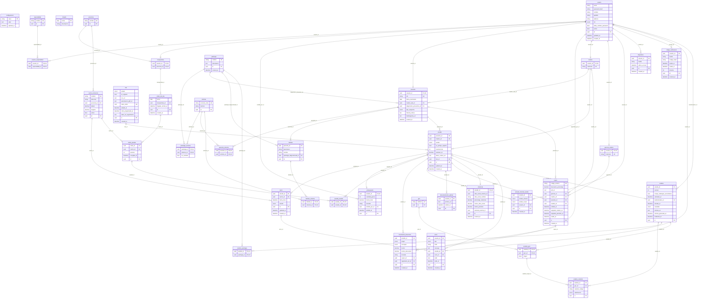

```mermaid
erDiagram
    analisis {
        uuid estudio_id FK
        int numero
        bool incluye_hallazgos_secundarios
        datetime solicitado_at
        uuid bioinformatico_id FK
        datetime tomado_at
        enum resultado
        text informe_url
        datetime informe_generado_at
        datetime finalizado_at
        uuid id PK
    }
    analisis_gen {
        uuid analisis_id PK,FK
        uuid gen_id PK,FK
        enum origen
    }
    analisis_patologia {
        uuid analisis_id PK,FK
        uuid patologia_id PK,FK
    }
    analisis_variante {
        uuid analisis_id FK
        uuid gen_id FK
        string variante_codigo
        enum clasificacion
        uuid id PK
    }
    aviso {
        uuid usuario_id FK
        enum tipo
        string titulo
        text mensaje
        uuid estudio_id FK
        uuid turno_id FK
        bool leido
        datetime leido_at
        uuid id PK
        datetime created_at
    }
    centro_extraccion {
        string nombre UK
        string direccion
        uuid provincia_id FK
        decimal latitud
        decimal longitud
        bool activo
        uuid id PK
    }
    cobertura {
        uuid estudio_id FK,UK
        uuid obra_social_externa_id
        string obra_social_nombre
        decimal porcentaje_cobertura
        decimal monto_obra_social
        decimal monto_paciente
        uuid solicitud_externa_id
        uuid id PK
        datetime created_at
    }
    codigo_verificacion {
        uuid usuario_id FK
        string huella
        string codigo_hash
        datetime expira_at
        datetime usado_at
        int intentos
        uuid id PK
        datetime created_at
    }
    configuracion {
        string clave PK
        text valor
        datetime updated_at
    }
    cupon {
        string codigo_externo UK
        decimal descuento_porcentaje
        text pdf_url
        uuid gerente_id FK
        uuid medico_id FK
        uuid paciente_id FK
        uuid estudio_id FK
        datetime emitido_at
        datetime asignado_medico_at
        datetime asignado_paciente_at
        datetime usado_at
        uuid id PK
        datetime created_at
    }
    dispositivo {
        uuid usuario_id FK
        string huella
        datetime ultimo_acceso
        uuid id PK
        datetime created_at
    }
    documentacion_judicial {
        uuid estudio_id FK
        text archivo_url
        datetime subido_at
        uuid id PK
    }
    especialidad {
        string nombre UK
        uuid id PK
    }
    estudio {
        uuid paciente_id FK
        uuid medico_id FK
        enum estado
        bool es_pompe_urgente
        int inasistencias
        decimal volumen_ml
        text datos_crudos_url
        uuid lote_id FK
        uuid id PK
        datetime updated_at
        datetime created_at
    }
    estudio_historial_estado {
        uuid estudio_id FK
        enum estado_anterior
        enum estado_nuevo
        uuid usuario_id FK
        uuid id PK
        datetime created_at
    }
    familiar {
        uuid paciente_id FK
        string parentesco
        string nombre
        uuid patologia_diagnosticada_id FK
        uuid id PK
    }
    familiar_sintoma {
        uuid familiar_id PK,FK
        uuid sintoma_id PK,FK
    }
    feriado {
        date fecha PK
        string descripcion
    }
    gen {
        string simbolo UK
        uuid id PK
    }
    gerente_medico {
        uuid usuario_id PK,FK
        string matricula UK
    }
    lote {
        enum estado
        bool es_urgente
        text csv_url
        text autorizacion_pdf_url
        uuid token_retiro UK
        datetime sellado_at
        datetime retiro_programado_at
        text fedex_url_seguimiento
        uuid id PK
        datetime created_at
    }
    medico {
        uuid usuario_id PK,FK
        string matricula UK
    }
    movimiento_financiero {
        uuid estudio_id FK
        enum origen
        enum concepto
        decimal monto
        decimal monto_descuento
        string moneda
        uuid cupon_id FK
        uuid registrado_por_id FK
        uuid id PK
        datetime created_at
    }
    orden_del_dia {
        date fecha
        uuid transportista_id FK
        datetime llegada_central_at
        uuid id PK
        datetime created_at
    }
    orden_parada {
        uuid orden_id FK
        uuid centro_id FK
        int posicion
        datetime recogida_at
        uuid id PK
    }
    paciente {
        uuid usuario_id PK,FK
        string dni UK
        date fecha_nacimiento
        uuid medico_alta_id FK
        uuid diagnostico_presuntivo_id FK
        enum tipo_sospecha
        text historia_clinica
        text familiograma_url
        datetime created_at
    }
    paciente_sintoma {
        uuid paciente_id PK,FK
        uuid sintoma_id PK,FK
    }
    parada_estudio {
        uuid parada_id PK,FK
        uuid estudio_id PK,FK
    }
    patologia {
        string nombre UK
        text descripcion
        uuid id PK
        datetime created_at
    }
    patologia_sintoma {
        uuid patologia_id PK,FK
        uuid sintoma_id PK,FK
        bool es_cardinal
    }
    presupuesto {
        uuid estudio_id FK,UK
        int cantidad_genes
        decimal monto_total
        string moneda
        uuid emitido_por_id FK
        datetime emitido_at
        uuid id PK
    }
    provincia {
        string nombre UK
        uuid id PK
    }
    sintoma {
        string snomed_code UK
        string termino
        uuid id PK
    }
    transportista {
        uuid usuario_id PK,FK
        uuid provincia_id FK,UK
    }
    turno {
        uuid estudio_id FK
        uuid centro_id FK
        datetime fecha_hora
        enum estado
        uuid id PK
        datetime updated_at
        datetime created_at
    }
    usuario {
        string email
        string password_hash
        string nombre
        string apellido
        string telefono
        enum rol
        bool debe_cambiar_password
        bool activo
        uuid id PK
        datetime updated_at
        datetime created_at
    }
    usuario_especialidad {
        uuid usuario_id PK,FK
        uuid especialidad_id PK,FK
    }
    estudio ||--o{ analisis : "estudio_id"
    usuario |o--o{ analisis : "bioinformatico_id"
    gen ||--o{ analisis_gen : "gen_id"
    analisis ||--o{ analisis_gen : "analisis_id"
    analisis ||--o{ analisis_patologia : "analisis_id"
    patologia ||--o{ analisis_patologia : "patologia_id"
    analisis ||--o{ analisis_variante : "analisis_id"
    analisis_gen ||--o{ analisis_variante : "analisis_id,gen_id"
    estudio |o--o{ aviso : "estudio_id"
    usuario ||--o{ aviso : "usuario_id"
    turno |o--o{ aviso : "turno_id"
    provincia ||--o{ centro_extraccion : "provincia_id"
    estudio ||--o| cobertura : "estudio_id"
    usuario ||--o{ codigo_verificacion : "usuario_id"
    paciente |o--o{ cupon : "paciente_id"
    estudio |o--o{ cupon : "estudio_id"
    medico |o--o{ cupon : "medico_id"
    gerente_medico ||--o{ cupon : "gerente_id"
    usuario ||--o{ dispositivo : "usuario_id"
    estudio ||--o{ documentacion_judicial : "estudio_id"
    medico ||--o{ estudio : "medico_id"
    lote |o--o{ estudio : "lote_id"
    paciente ||--o{ estudio : "paciente_id"
    estudio ||--o{ estudio_historial_estado : "estudio_id"
    usuario |o--o{ estudio_historial_estado : "usuario_id"
    patologia |o--o{ familiar : "patologia_diagnosticada_id"
    paciente ||--o{ familiar : "paciente_id"
    familiar ||--o{ familiar_sintoma : "familiar_id"
    sintoma ||--o{ familiar_sintoma : "sintoma_id"
    usuario ||--o| gerente_medico : "usuario_id"
    usuario ||--o| medico : "usuario_id"
    usuario |o--o{ movimiento_financiero : "registrado_por_id"
    estudio ||--o{ movimiento_financiero : "estudio_id"
    cupon |o--o{ movimiento_financiero : "cupon_id"
    transportista ||--o{ orden_del_dia : "transportista_id"
    orden_del_dia ||--o{ orden_parada : "orden_id"
    centro_extraccion ||--o{ orden_parada : "centro_id"
    patologia ||--o{ paciente : "diagnostico_presuntivo_id"
    usuario ||--o| paciente : "usuario_id"
    medico ||--o{ paciente : "medico_alta_id"
    sintoma ||--o{ paciente_sintoma : "sintoma_id"
    paciente ||--o{ paciente_sintoma : "paciente_id"
    estudio ||--o{ parada_estudio : "estudio_id"
    orden_parada ||--o{ parada_estudio : "parada_id"
    patologia ||--o{ patologia_sintoma : "patologia_id"
    sintoma ||--o{ patologia_sintoma : "sintoma_id"
    usuario ||--o{ presupuesto : "emitido_por_id"
    estudio ||--o| presupuesto : "estudio_id"
    provincia ||--o| transportista : "provincia_id"
    usuario ||--o| transportista : "usuario_id"
    centro_extraccion ||--o{ turno : "centro_id"
    estudio ||--o{ turno : "estudio_id"
    especialidad ||--o{ usuario_especialidad : "especialidad_id"
    usuario ||--o{ usuario_especialidad : "usuario_id"
```
