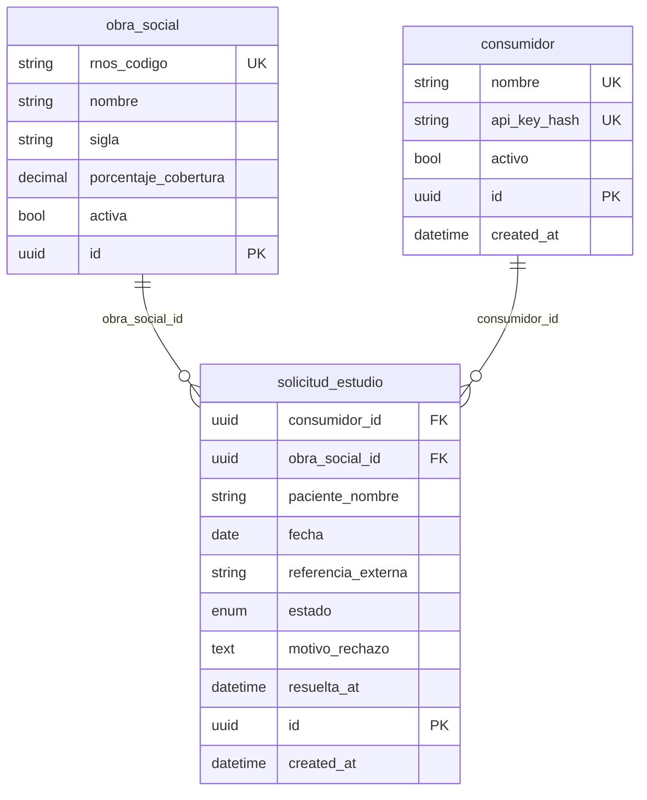

```mermaid
erDiagram
    consumidor {
        string nombre UK
        string api_key_hash UK
        bool activo
        uuid id PK
        datetime created_at
    }
    obra_social {
        string rnos_codigo UK
        string nombre
        string sigla
        decimal porcentaje_cobertura
        bool activa
        uuid id PK
    }
    solicitud_estudio {
        uuid consumidor_id FK
        uuid obra_social_id FK
        string paciente_nombre
        date fecha
        string referencia_externa
        enum estado
        text motivo_rechazo
        datetime resuelta_at
        uuid id PK
        datetime created_at
    }
    obra_social ||--o{ solicitud_estudio : "obra_social_id"
    consumidor ||--o{ solicitud_estudio : "consumidor_id"
```
